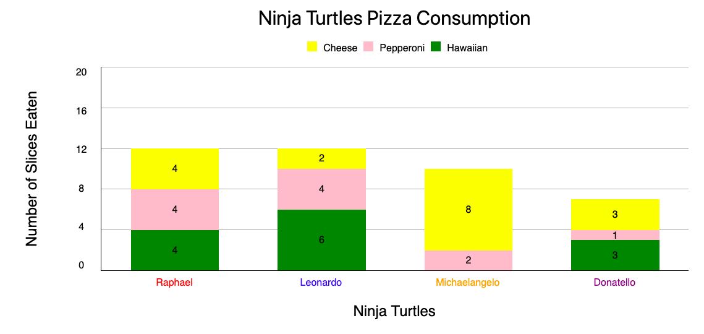

# Bar Chart Project

## Introduction

The purpose of this library is to aid a developer in generating bar charts for their webpage. This library can be used to create standard bar charts with just one data set, as well as stacked bar charts with multiple data sets.

## Usage Guide

A developer looking to add a bar chart to a webpage can do so easily by specifying the input for a few variables in the bar-chart.js file:
* data
* options
* element

After this has been done, simply run the page and the bar chart will be created in the specified element.

### The 'data' Variable

The 'data' variable includes the following:
* An array containing all of the values to be plotted. This array contains nested arrays that contain the values for each data set. 
  - For example, if you wanted to plot two bars where each bar contained a stack of three bars, this array would contain two nested arrays, each with three values. 
  - If you wanted to plot two bars for a standard (non-stacked) bar chart, then this array would contain two arrays, each with one value. 
* An array specifying the name of each data set (used to create a legend)
* An array specifying the bar colors that should correspond to each data set
* An array specifying the x-axis labels for the data
* An array specifying the colors of the x-axis labels

### The 'options' Variable

The 'options' variable gives the user the ability to specify the following:
* Chart width
* Chart height
* Chart title
* Chart title text color
* Chart title font size
* Y-axis title
* X-axis title
* Bar value position (top, middle, or bottom)
* Bar spacing (small, medium, large)

### The 'element' Variable

The 'element' variable should be a jQuery selector that specifies the html element that the chart should be generated in.

## Examples

### Standard Bar Chart

### Stacked Bar Chart

## Git Pages Link

[Git Pages](https://dexterchan94.github.io./)

## Resources Used

* [MDN Web Docs](https://developer.mozilla.org/en-US/docs/Web/JavaScript)
* [W3 Schools](https://www.w3schools.com/jsref/default.asp)
* [jQuery Tutorial for Beginners](https://www.youtube.com/watch?v=2OMzGhlIZpg)
* [The Web Developer Bootcamp by Colt Steele](https://www.udemy.com/course/the-web-developer-bootcamp/)
